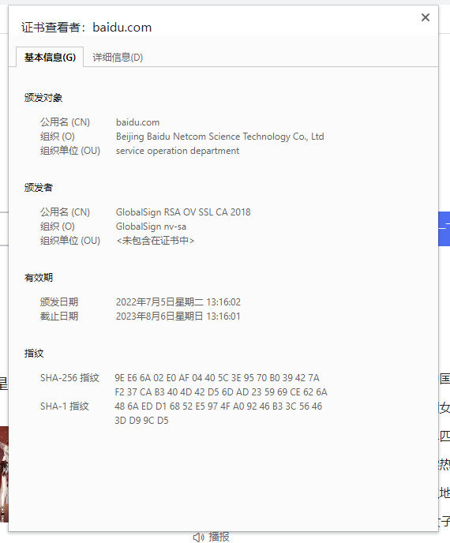
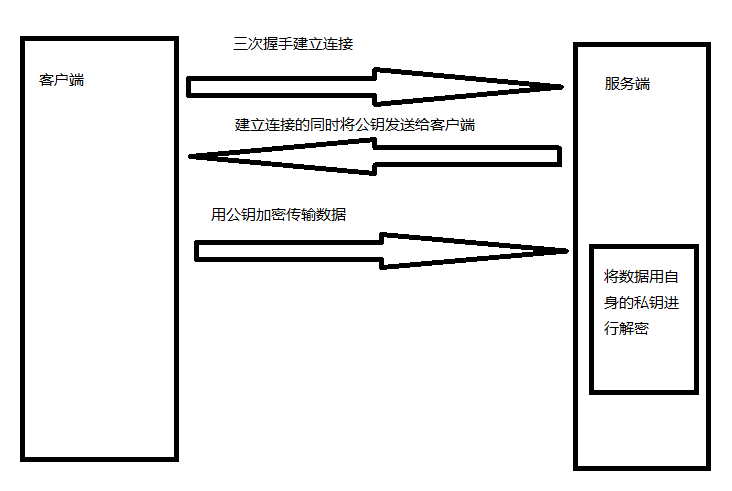

# https

    HTTPS （全称：Hypertext Transfer Protocol Secure ），是以安全为目标的 HTTP 通道，在HTTP的基础上通过传输加密和身份认证保证了传输过程的安全性 。HTTPS 在HTTP 的基础下加入SSL，HTTPS 的安全基础是 SSL，因此加密的详细内容就需要 SSL。 HTTPS 存在不同于 HTTP 的默认端口及一个加密/身份验证层（在 HTTP与 TCP 之间）。这个系统提供了身份验证与加密通讯方法。它被广泛用于万维网上安全敏感的通讯，例如交易支付等方面。（百度百科）

## ssl

    证书由专业的证书颁发机构颁发，一份 SSL 证书包括一个公共密钥和一个私用密钥。公共密钥用于加密信息，私用密钥用于解译加密的信息

## 非对称加密

