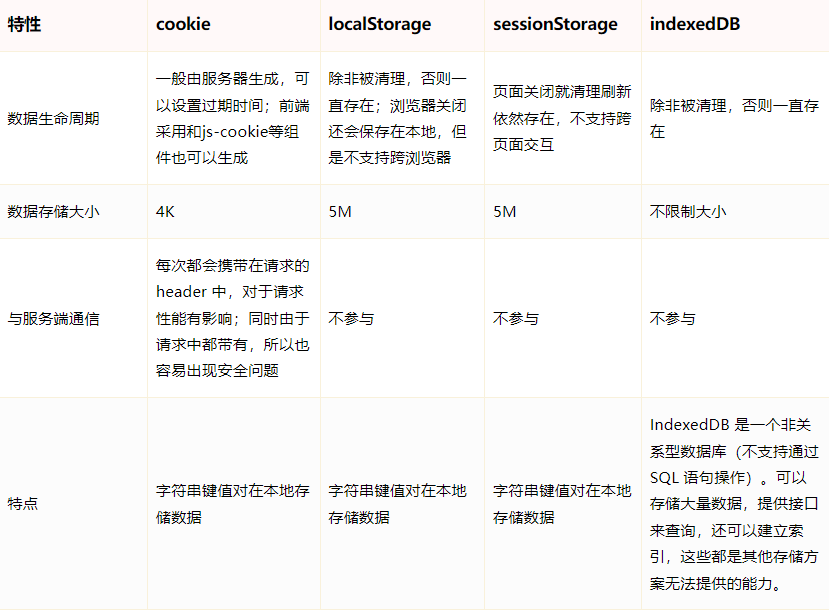
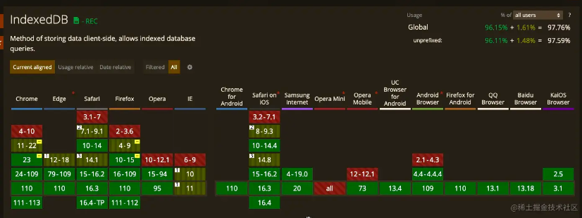

# indexedDB

    参考文章https://zhuanlan.zhihu.com/p/429086021

## indexedDB与其他缓存的对比

## indexedDB的兼容情况

## IndexedDB使用场景

    所有的场景都基于客户端需要存储大量数据的前提下：

    1.数据可视化等界面，大量数据，每次请求会消耗很大性能。
    2.即时聊天工具，大量消息需要存在本地。
    3.其它存储方式容量不满足时，不得已使用IndexedDB

## indexedDB特点

    1.非关系型数据库(NoSql)
    MySQL等数据库都是关系型数据库，它们的主要特点就是数据都以一张二维表的形式存储，而Indexed DB是非关系型数据库，主要以键值对的形式存储数据。

    2.持久化存储
    cookie、localStorage、sessionStorage等方式存储的数据当我们清楚浏览器缓存后，这些数据都会被清除掉的，而使用IndexedDB存储的数据则不会，除非手动删除该数据库。

    3.异步操作
    IndexedDB操作时不会锁死浏览器，用户依然可以进行其他的操作，这与localstorage形成鲜明的对比，后者是同步的。

    4.支持事务
    IndexedDB支持事务(transaction)，这意味着一系列的操作步骤之中，只要有一步失败了，整个事务都会取消，数据库回滚的事务发生之前的状态，这和MySQL等数据库的事务类似。

    5.同源策略
    IndexedDB同样存在同源限制，每个数据库对应创建它的域名。网页只能访问自身域名下的数据库，而不能访问跨域的数据库。

    6.存储容量大

## 核心概念

    数据库：IDBDatabase 对象，数据库有版本概念，同一时刻只能有一个版本，每个域名可以建多个数据库
    对象仓库：IDBObjectStore 对象，类似于关系型数据库的表格
    索引： IDBIndex 对象，可以在对象仓库中，为不同的属性建立索引，主键建立默认索引
    事务： IDBTransaction 对象，增删改查都需要通过事务来完成，事务对象提供了error,abord,complete三个回调方法，监听操作结果
    操作请求：IDBRequest 对象
    指针： IDBCursor 对象
    主键集合：IDBKeyRange 对象，主键是默认建立索引的属性，可以取当前层级的某个属性，也可以指定下一层对象的属性，还可以是一个递增的整数
