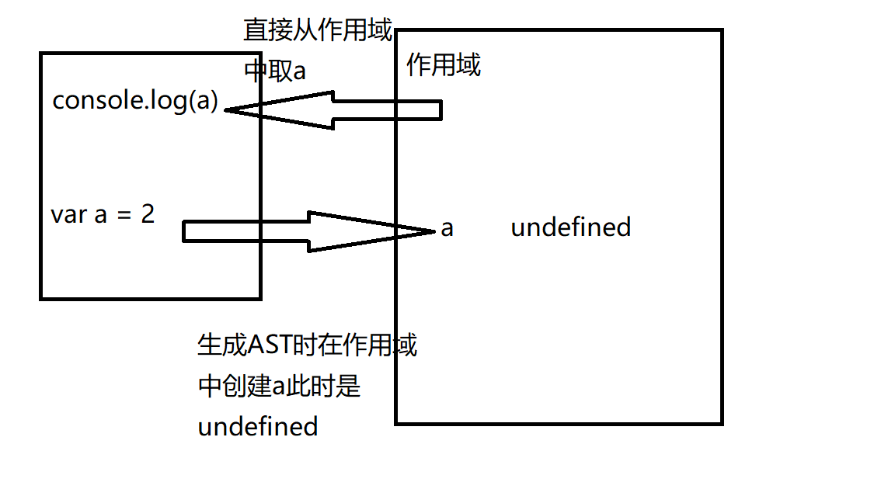
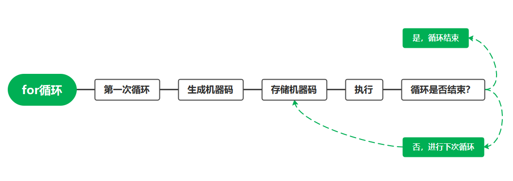
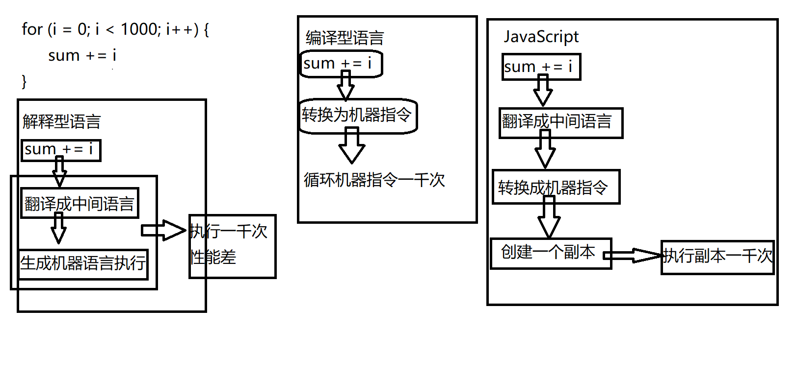

# javascapt是解释型语言

## 百度百科对解释型语言的介绍
    
    相对于编译型语言存在的，源代码不是直接翻译成机器语言，而是先翻译成中间代码，再由解释器对中间代码进行解释运行。比如Python/JavaScript / Perl /Shell等都是解释型语言。解释型语言：程序不需要编译，程序在运行时才翻译成机器语言，每执 行一次都要翻译一次。因此效率比较低。比如Basic语言，专门有一个解释器能够直接执行Basic程 序，每个语句都是执行的时候才翻译。(在运行程序的时候才翻译，专门有一个解释器去进行翻译，每个语句都是执行的时候才翻译。效率比较低，依赖解释器，跨 平台性好.)

## 从var开始遇见的问题

    console.log(a)      // undefined
    var a

    console.log(b)      // b is not defined

    
### 变量提升的矛盾

    这里应该提到var的一个特性：变量提升，即var声明代码执行之前执行调用，会输出undefined而不会报错，但这个与解释型语言的概念相背，因为明明代码没有执行到声明，那我在执行console的时候怎么会知道这个变量在下面被定义了呢。所以js应该是有一个编译过程的

## 预编译过程

    js是一门解释型语言，但是在V8引擎中，会对js进行一个编译，叫做预编译过程，这个编译过程是发生在v8引擎中的。其实可以这么理解，js是一门解释型语言从上执行到下，它本身是没有编译的，但是在正常环境中，v8引擎会主动的进行一个预编译动作，这本身与js是无关的。

    预编译过程分为三步：分词，词法分析，生成AST

    var a = 1;

    v8引擎通过有限状态机对代码字符串进行分词以及词法分析，比方说
    1.分词：[var, a, =, 1]
    会将代码块变成一个字符数组

    2.词法分析：生成一个token数组
    [
        { type: 'Keyword', value: 'var', loc: [Object] },
        { type: 'Identifier', value: 'a', loc: [Object] },
        { type: 'Punctuator', value: '=', loc: [Object] },
        { type: 'Numeric', value: '1', loc: [Object] },
        { type: 'Punctuator', value: ';', loc: [Object] }
    ]

    3.生成AST
    {
        "type": "Program",
        "start": 0,
        "end": 10,
        "body": [
            {
            "type": "VariableDeclaration",
            "start": 0,
            "end": 10,
            "declarations": [
                {
                "type": "VariableDeclarator",
                "start": 4,
                "end": 9,
                "id": {
                    "type": "Identifier",
                    "start": 4,
                    "end": 5,
                    "name": "a"
                },
                "init": {
                    "type": "Literal",
                    "start": 8,
                    "end": 9,
                    "value": 1,
                    "raw": "1"
                }
                }
            ],
            "kind": "var"
            }
        ],
        "sourceType": "module"
    }

    接下来ast会直接交给v8引擎去执行生成机器码

## v8引擎做的一些优化

    v8引擎在很多地方会进行优化，以for循环为例

    一般在for循环中，v8引擎会对for循环体中的代码进行推测，在第一次循环生成机器码后，第二次循环的时候，不会去重新生成机器码，而是对第一次生成的机器码进行复用。

    但是在foreach中，循环体需要进入一个参数item，所以导致V8引擎无法对内容进行推测，所以循环体会再生成一次机器码，因此从性能来讲for循环是比foreach来的要高的

    无法推测的情况：with eval
    这两个关键词将导致引擎对循环体内容无法预测，成为真正的解释型语言，因为不知道循环体内容，所以最好的优化就是不优化，将对性能造成影响