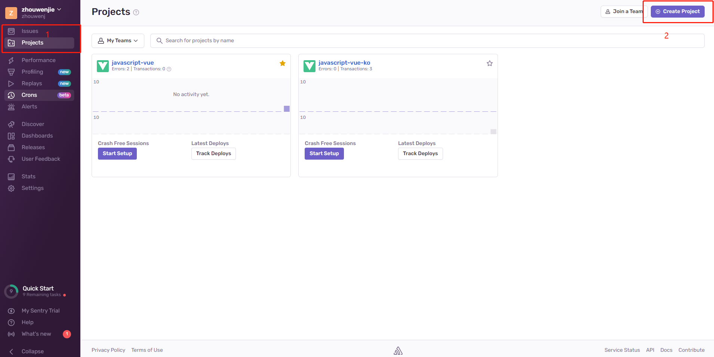
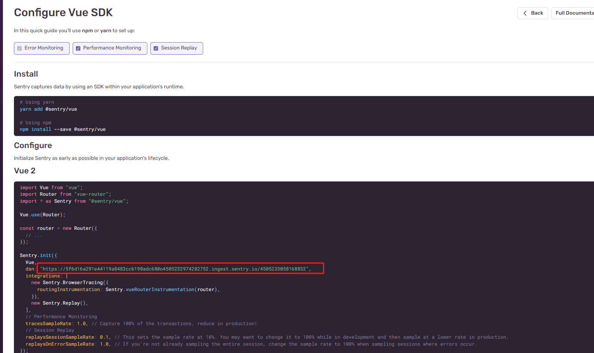
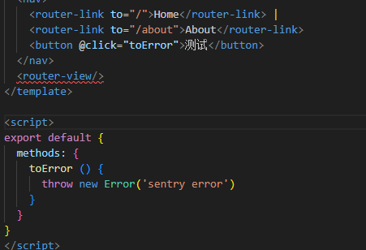
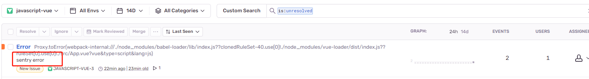

# sentry使用笔记

## 配置

    之前在掘金上或者百度上说是可以通过sentry提供的本地搭建工具进行本地化接受错误，onpremise或者self-hosted
    但是使用的时候需要安装docker，python3安装完之后执行./install.sh配置账号密码的时候，命令行直接弹出一下就消失了
    搜索是说sh是linux上的命令在windows无法执行，然后可以使用git bash去执行./install.sh
    在使用了git bash之后，提示

    Seems like you are using an MSYS2-based system (such as Git Bash) which is not supported. Please use WSL instead

    感觉搞来搞去太麻烦了，索性直接挂加速器使用官方服务器

    注册登录进去之后先点击1的project，然后点击2的create project，创建一个新的项目

    之后按照提示，安装依赖，并配置sentry，此时会有个dsn，这个是每个项目都不一样的，配置完成之后进行一次测试

    接收到错误了，配置成功了

