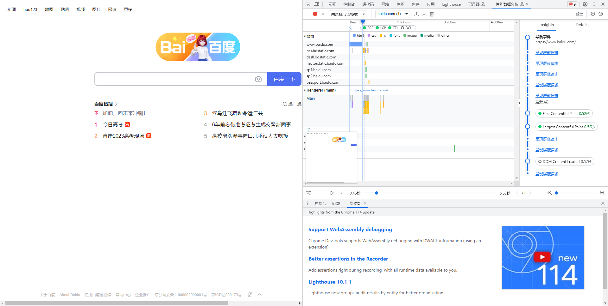

# 一些前端性能指标

    参考https://juejin.cn/post/7223280402475089978

## performance

    首先来介绍performance这个是挂载在window下的一个对象，上面暂存了页面很多关键节点的数据
    
### memory

    jsHeapSizeLimit (表示当前页面最多可以获得的 JavaScript 堆大小)
    totalJSHeapSize (表示当前页面已经分配的 JavaScript 堆大小)
    usedJSHeapSize (表示当前页面 JavaScript 已经使用的堆大小)

### navigation

    redirectCount，重定向的数量，经过多少次重定向进入这个页面 （注：这个页面有同源限制，只能统计同源情况下）
    type，进入页面的方式
        0，正常进入非刷新，非重定向
        1，通过刷新的方式进入
        2，通过前进回退按钮进入，chrome通过历史记录不打开历史记录页面直接进入进入即2，打开历史记录页面进入即0
        255，非是上述情况

### timing

    navigationStart：表示上一个文档卸载结束时的unix时间戳，如果没有上一个文档，则等于fetchStart。
    unloadEventStart：表示前一个网页（与当前页面同域）unload的时间戳，如无前一个网页unloade或前一个网页与当前不同域，则为0。
    unloadEventEnd: 返回前一个unload时间绑定的回调执行完毕的时间戳。
    redirectStart：前一个Http重定向发送时的时间。有跳转且是同域名内重定向，否则为0。
    redirectEnd：前一个Http重定向完成时的时间。有跳转且是同域名内重定向，否则为0。
    fetchStart：浏览器准备使用http请求文档的时间，在检查本地缓存之前。
    domainLookupStart/domainLookupEnd：DNS域名查询开始/结束的时间，如果使用本地缓存（则无需DNC查询）或持久链接，则和fetchStart一致。
    connectStart：HTTP（TCP）开始或重新建立链接的时间，如果是持久链接，则和fetchStart一致。
    connectEnd：HTTP（TCP）完成建立链接的时间（完成握手），如果是持久链接，则和fetchStart一致。
    secureConnectionStart：Https链接开始的时间，如果不是安全链接则为0。
    requestStart：http在建立链接之后，正式开始请求真实文档的时间，包括从本地读取缓存。
    responseStart：http开始接收响应的时间（获取第一个字节），包括从本地读取缓存。
    responseEnd：http响应接收完全的时间（最后一个字节），包括从本地读取缓存。
    domLoading：开始解析渲染DOM树的时间。
    domInteractive：完成解析DOM树的时间。
    domContentLoadedEventStart：DOM解析完成后，页面内资源加载开始的时间。
    domContentLoadedEventEnd：DOM解析完成后，网页内资源加载完成的时间（如js脚本加载执行完）
    domComplete：DOM树解析完，资源也准备就绪。
    loadEventStart：load事件发送给文档，即load函数开始执行时。
    loadEventEnd：load函数执行完毕的时间。

    页面卸载部分
    
        卸载：navigationStart、unloadEventStart、unloadEventEnd

    网络部分

        跳转：redirectStart、redirectEnd
        请求文档：fetchStart
        DNS查询：domainLookupStart、domainLookupEnd
        连接建立：connectStart、connectEnd
        请求：requestStart、responseStart、responseEnd

    页面解析部分

        解析dom：domLoading、domInteractive
        资源加载，dom渲染：domContentLoadedEventStart、domContentLoadedEventEnd、domComplete

## 前端性能核心指标（TTFB、FP、FCP、LCP、TTI、DCL）

    chrome的性能分析页面

    web-vitals模块也能获取到数据

    TTFB指代从资源的请求到响应第一个字节的时间跨度
    navigationStart：表示上一个文档卸载结束时的unix时间戳，如果没有上一个文档，则等于fetchStart。
    TTFB = performance.timing.responseStart - performance.timing.navigationStart

    import {onTTFB} from 'web-vitals';
    console.log(onTTFB)

    FP（白屏时间）
    FP指代用户发起请求到浏览器开始渲染页面内第一个像素点所经过的时间。一般html解析结束之后就会开始触发。
    白屏时间长短对用户体验影响极大，因此计算时尽量保证准确。！！！
    其中影响因素包括重定向时延，DNS查询时延，链接建立延迟，请求响应时延
    performance.getEntries('paint').filter(entry => entry.name == 'first-paint')[0].startTime

    FCP（首次内容绘制） 
    不同于LCP，FCP只渲染了部分内容(比方说骨架屏)。同样的基于控制台我们可以获得FCP，值得注意的是由于单页应用的广泛使用基于控制器的FCP已经不能满足我们的使用，因此在计算时需分情况处理。
    performance.getEntries('paint').filter(entry => entry.name == 'first-contentful-paint')[0].startTime;

    LCP (最大内容渲染时间)
    LCP指代页面中最大的内容完成绘制的时间。通常这类内容指代页面可视区域内，包括img，video，包含文本节点或其他行内块级元素子元素的块级元素等元素。通常LCP的评定标准是基于元素在用户可视区域内的可见大小。
    在计算LCP的过程中，仅仅计算最大且已经完成渲染的元素，如果后续出现一个更大的元素则会继续报告一个新的PerformanceEntry。但是那个更大的并不会替代前一个已经作为最大的元素节点，除非前一个已经作为最大的元素节点已经被移除。
    new PerformanceObserver((entryList) => {  
        for (const entry of entryList.getEntries()) {  
            // entry.startTime 的值即为LCP 
        }  
    }).observe({type: 'largest-contentful-paint', buffered: true});

    TTI (最早可交互时间)
    TTI指代页面从加载资源到页面渲染，最早可以与用户进行完全可交互的时间，也可以用来描述页面的响应快慢，如果TTI过长容易被用户将页面当成已失败处理。
    当页面存在有用的内容，可见元素的关联事件函数已绑定注册，事件函数可以在事件发生后50ms内执行，则可以认为当前页面已达到完全可交互的状态。
    如需根据网页的性能跟踪计算 TTI，请执行以下步骤：
        先进行FCP即首屏绘制。
        沿时间轴正向搜索时长至少为 5 秒的安静窗口。（安静窗口：没有长任务且不超过两个正在处理的网络 GET 请求）
        沿时间轴反向搜索安静窗口之前的最后一个长任务，如果没有找到长任务，则在 FCP 步骤停止执行。
        TTI 是安静窗口之前最后一个长任务的结束时间（如果没有找到长任务，则与 FCP 值相同。
    计算TTI的方法:
        通过监听第一个长任务去计算TTI
        js复制代码new PerformanceObserver((list) => {
        for (const entry of list.getEntries()) {
            // entry.startTime 的值即为TTI
        }
        }).observe({entryTypes: ['longtask']});

    DCL (DOMContentLoaded)
    DCL指代当HTML 文档被完全加载和解析完成之后，DOMContentLoaded 事件被触发，无需等待样式，图像和子框架的完成加载的时间。
    document.addeventListener('DOMContentLoaded', function() {
        +new Date() - window.performanceObser.timing.navigationStart
    }, false);

    另一篇非常值得阅读的文章
    https://juejin.cn/post/7195496297150709821

## SDK 如何降低侵入，减少用户性能损耗？体积控制和灵活使用可以兼得吗？

    常需要尽早执行，其资源加载通常也会造成一定的性能影响。更大的资源加载可能会导致更慢的 Load，LCP，TTI 时间，影响用户体验。
    sdk实际中可能遇见的问题
        页面才十几K，SDK要几百K
        SDK加载太慢，阻塞后续逻辑执行
        一些功能不用一开始就加载执行，抢占页面逻辑的执行时间
        大量的逻辑使得页面首屏指标出现劣化

        1.异步加载
        如果通过 JS 代码创建 script 脚本并追加到页面中，新增的 script 脚本默认会携带 async 属性，这意味着这这部分代码将通过async方式延迟加载。下载阶段不会阻塞用户的页面加载逻辑。从而一定程度的提升用户的首屏性能表现。
        document.createElement('script').....

        2.预收集
        试想一下我们通过 npm 或者 cdn 的方式直接引入监控代码，script必须置于业务逻辑最前端，这是因为若异常先于监控代码加载发生，当监控代码就位时，是没有办法捕获到历史上曾经发生过的异常的。但将script置于前端将不可避免的对用户页面造成一定阻塞，且用户的页面可能会因此受到我们监控 sdk 服务可用性的影响。
        为了解决这个问题，我们可以同步的加载一段精简的代码，在其中启动 addEventListener 来采集先于监控主要逻辑发生的错误。并存储到一个全局队列中，这样，当监控代码就位，我们只需要读取全局队列中的缓存数据并上报，就不会出现漏报的情况了。

        3.事件驱动与插件化