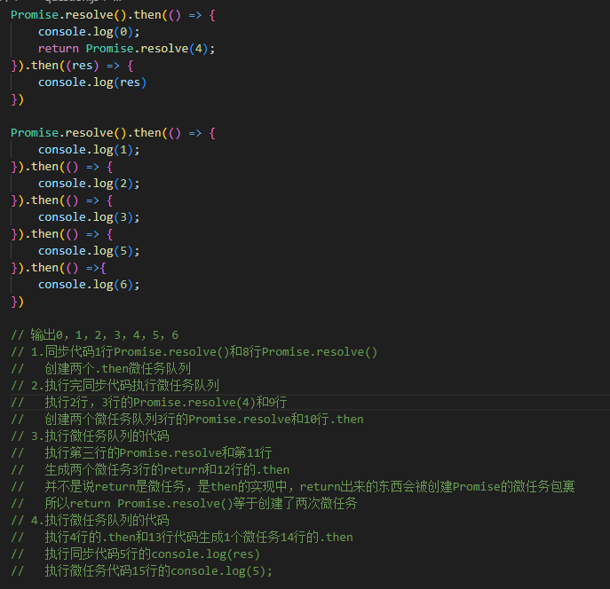
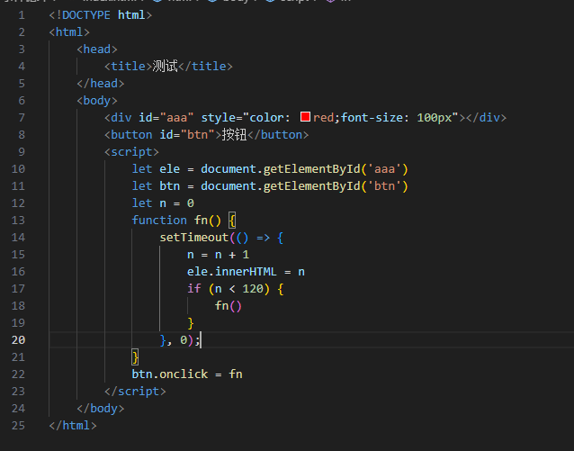
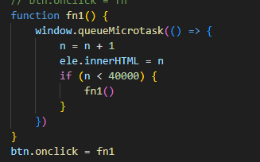
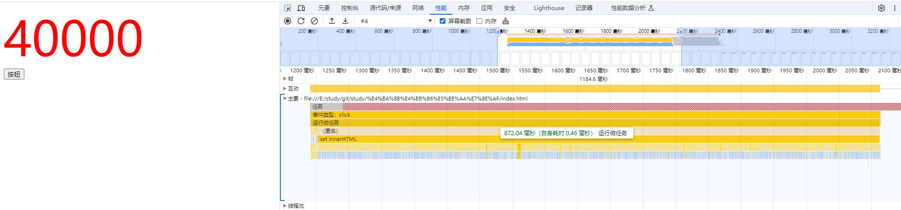
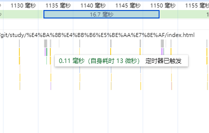
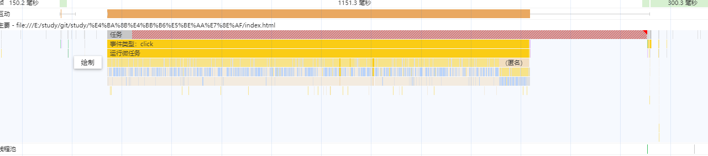

# 浏览器的事件逻辑

## 从一道问题开始

    似乎浏览器的任务队列没有看上去这么简单

## 执行一段循环的宏任务

    页面上也是可以看出数字从0-120进行了渐变
    黄色的是settimeout函数调用，可以看出来宏任务是不连续的

## 执行一段微任务

    可以看出来页面从1-40000一下子就完成了，没有渐变的过程
    从性能上可以看出来微任务是连续的

## 浏览器的帧

    突然想到了之前看过的浏览器的帧
    浏览器每帧会收集js的chunk然后去执行然后再执行栅格化以及渲染，如果把这些chunk理解为微任务，那么一切都说的通了
    结论1.0：
        浏览器每帧会收集js的chunk，然后组成一个队列，这些chunk就是微任务，如果在这些微任务中再生成了微任务
        那么生成的微任务会插入到当前帧的队尾
        如果生成了宏任务，那么该宏任务会插入到下一帧或者后面的某一帧（settimeout可以设置时间）

## 由宏任务引起的问题

    但在实际测试中发现好像有点不一样，如果说每帧都会造成渲染的话，那么我写两个settimeout为0造成页面变化的函数
    那他页面应该会有闪屏的情况，但是在测试中，闪屏的情况为偶现，查了一下浏览器的帧率为60帧，大概是17ms，
    但是在第一个宏任务测试中，速度明显是比17ms快的
    结论2.0：
        浏览器的帧分为逻辑帧与渲染帧，渲染帧一般为1秒60帧，而逻辑帧要短很多
    再回到第一个测试

    
    在一个渲染帧里面大概执行了四次逻辑帧，而且点击上面每帧的快照，发现变化大概是0-4，4-8的变化
    那再测试下刚才的微任务

    
    可以看出来在微任务队列执行过程中，绘制没有被触发，这似乎就是js阻塞的原因了
    结论3.0
        打个比方，假设浏览器的事件是一个公共厕所，逻辑帧是用户，渲染帧是清洁工，清洁工在一个17ms内，
        要去厕所清洁一次，然后大概3-4ms会来一个上厕所的用户，他们上厕所的时间有长有短，正常进去了就出来了，
        那么清洁工就能按时进去打扫（渲染），但有些人就是劲大，要上好久（长微任务队列），清洁工只能在外面等着他上完

    完毕！