# qiankun使用笔记

## base基座应用

    在基座应用base中，需要进行以下配置，安装qiankun依赖，调用registerMicroApps函数注册子应用，再通过start函数进行启动

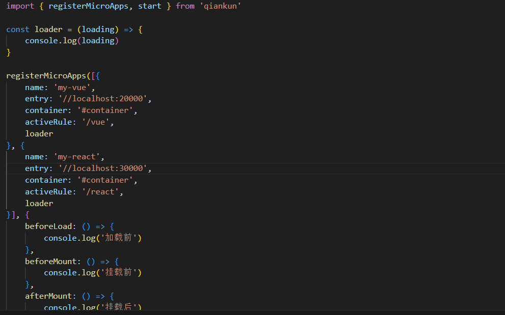

## vue3项目

vue3项目中，进行以下配置：

    vue.config.js:

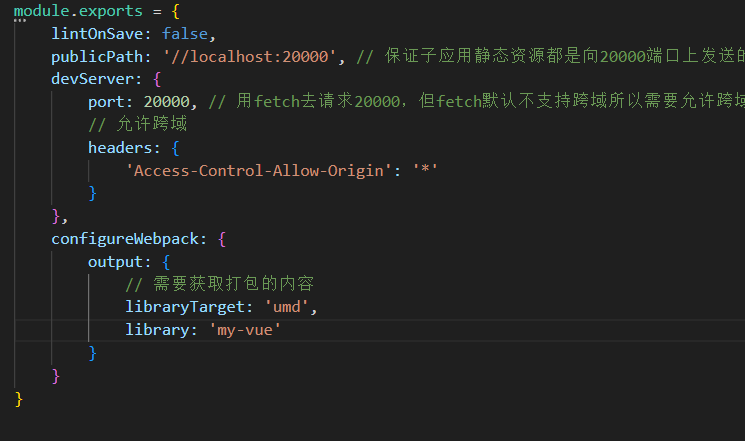

    首先在路由文件中，将routes输出

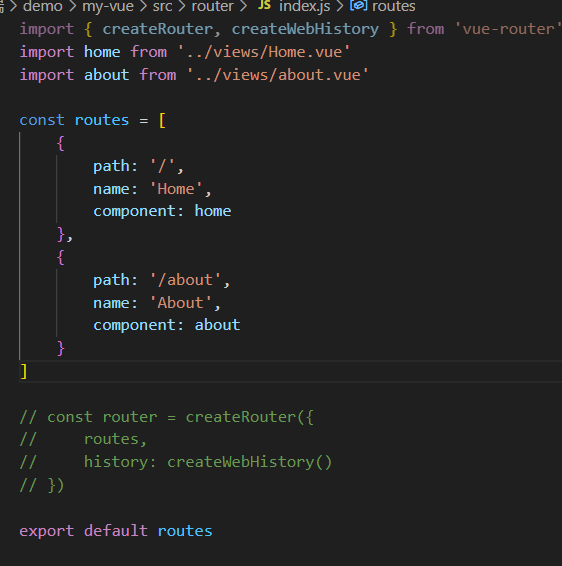

    为什么要这么做呢，因为在基座应用中，子应用之间是通过不同的url来进行切换，比如注册中my-vue的activeRule是'/vue'，那么my-vue在基座应用中访问的实际地址就应该是从http://localhost:3000/vue#/开始，调用createWebHashHistory组成修改后的router，然后再将页面挂载到传入的container元素中
    main.js

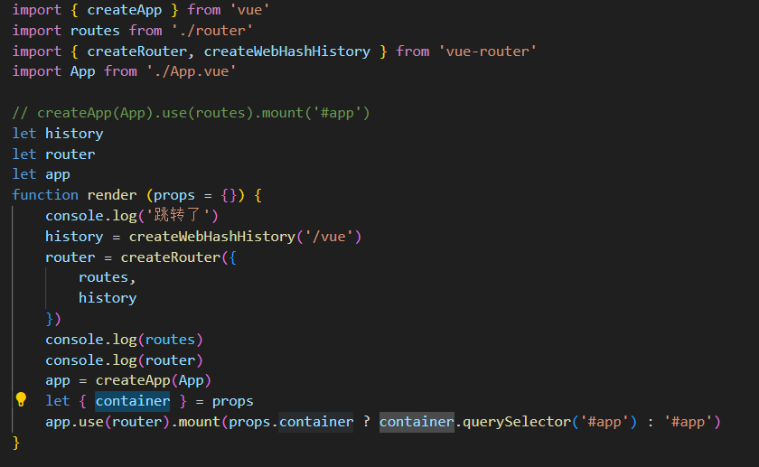

    main.js
    接下来是创建生命周期，暴露给基座应用

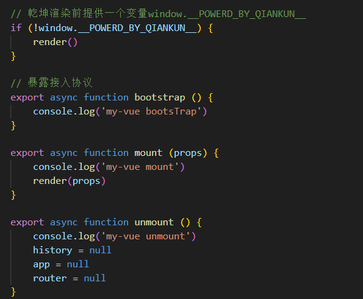

## react项目

    .rescriptsrc.js
    
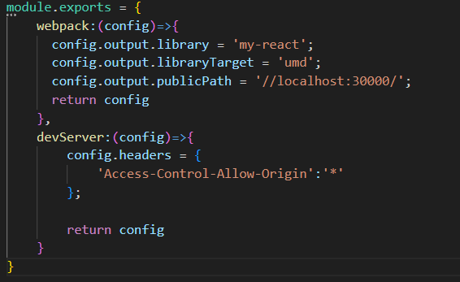

    .env

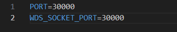

    index.js

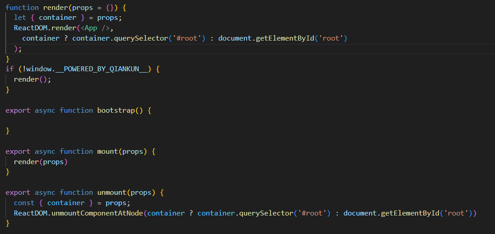

    package.json

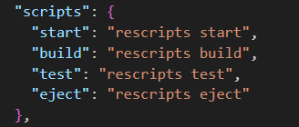

### react项目中遇到的一些问题

    可能是对react不熟练导致的
    1.最开始创建的react项目使用的是react18，在index.js的ReactDOM.render报错。原因是react18已不支持这种写法，改为
    const root = createRoot('container')
    root.render(<App />)

    2.通过rescriptsrc打包，修改package.json为"start": "rescripts start"，提示rescripts不是可执行的程序，安装@rescripts/cli
    继续执行，报Failed to decode param '/%PUBLIC_URL%/favicon.ico'，可能是由于版本引起的问题

    3.页面html能获取到，但是提示没有生命周期函数，图片获取异常

    最后使用了跟网上一样的react17版本，@rescripts/cli：^0.0.16"

## 使用总结

    1.子应用中需要配置静态资源地址publicPath供基座应用调用，且需要允许跨域，基座应用通过fetch获取html
    2.子应用中还需要配置打包类型为umd
    2.基座应用中要对子应用进行注册，包括name匹配子应用打包的libiary，entry匹配子应用的publicPath获取静态资源，container为子应用页面挂载在基座应用上的元素，activeRule为该子应用在基座应用上对应的URL

    问题：如何在一个页面渲染多个子应用，类似大屏效果

## qiankun的一些原理

    node_modules中的模块，查看registerMicroApps方法

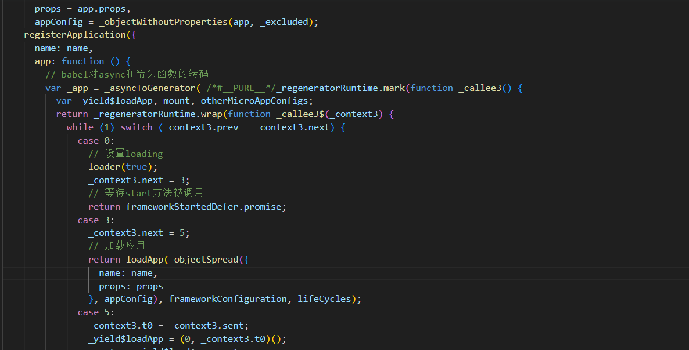

    因为被babel转码过，所以不太好阅读，直接去git把项目拉下来（https://github.com/umijs/qiankun.git）
    再查看registerMicroApps方法，替换掉node_modules里面的registerMicroApps方法

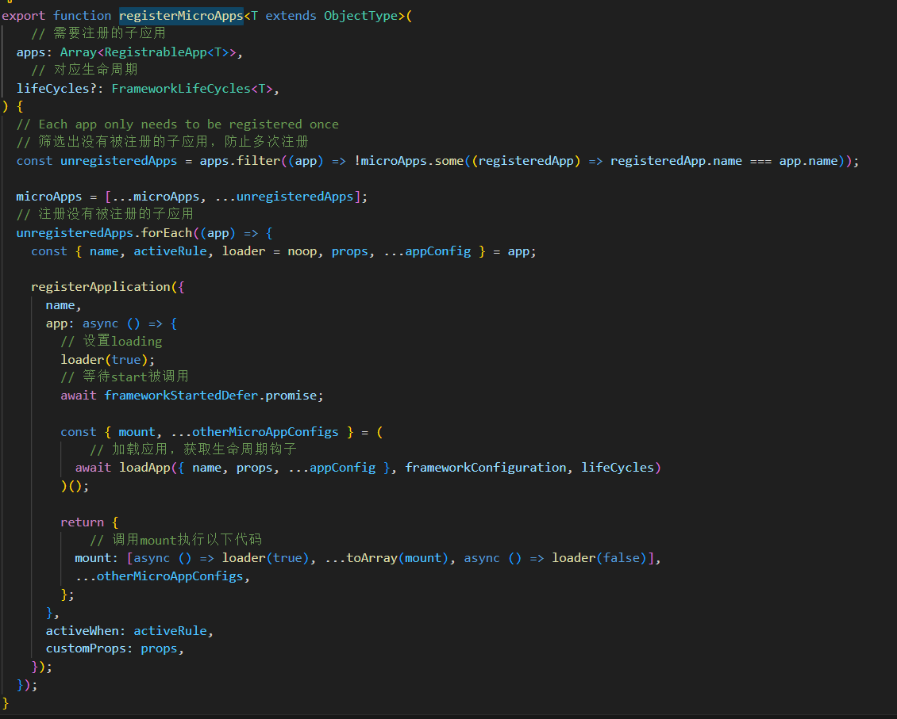

    可以看出registerMicroApps->获取没有注册过的Apps->遍历执行registerApplication

    再看start方法，用源码中的方法图换掉node_modules里面的start方法

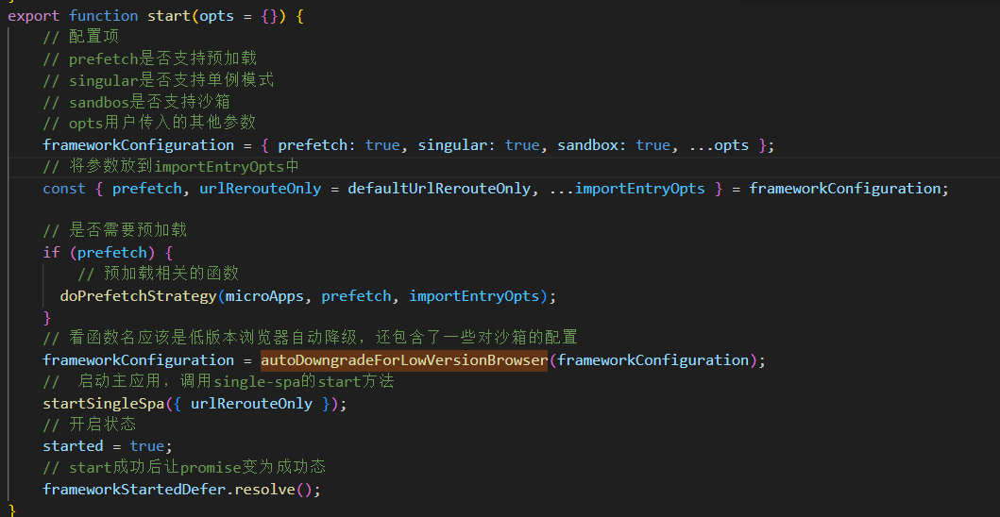

    autoDowngradeForLowVersionBrowser方法，同样进行替换

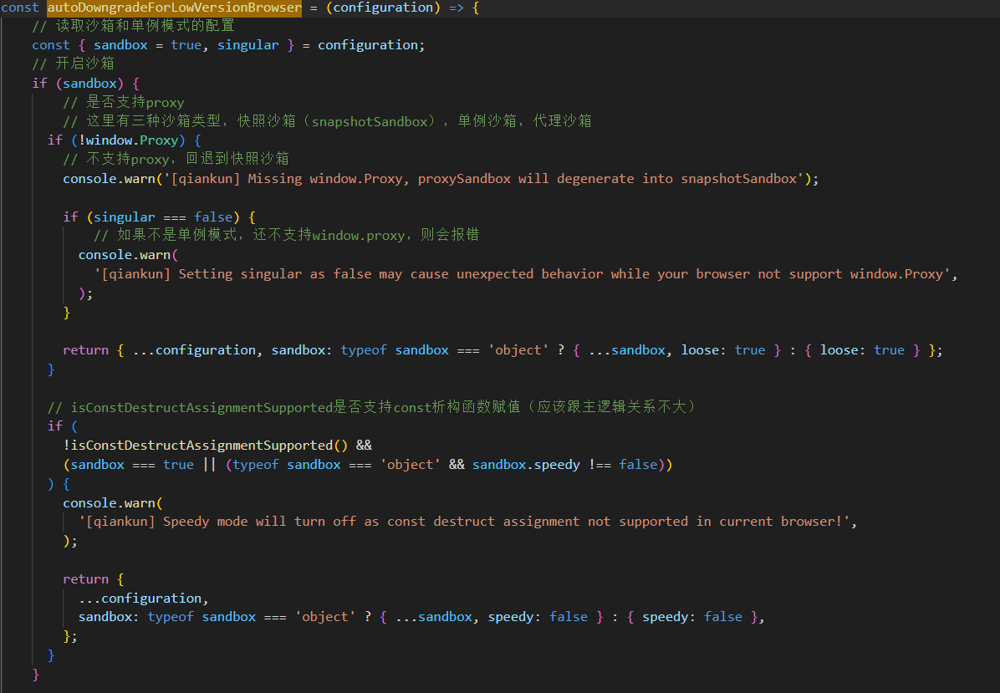
    
    然后是start函数中的预加载方法，在start中调用了函数doPrefetchStrategy，再找到prefetch.js文件中，在函数中执行了prefetchAfterFirstMounted函数

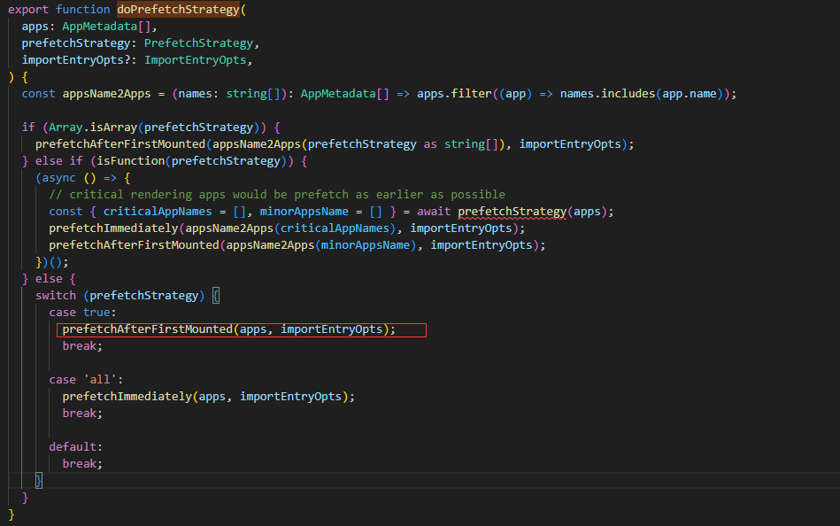

    prefecth.js中prefetchAfterFirstMounted方法

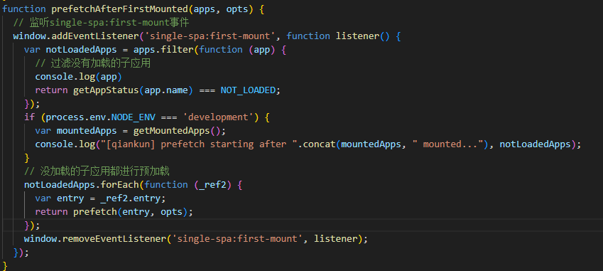

    预加载的prefetch方法,等第一个应用加载完毕后，再去调用importEntry获取其他app资源

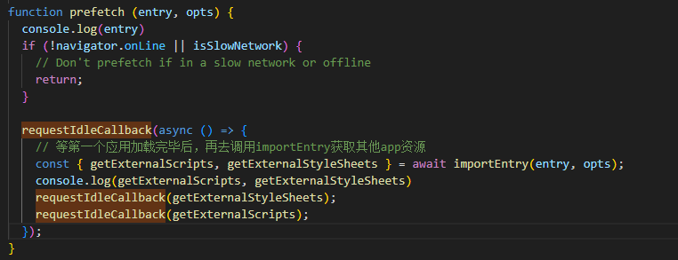

    start过程：是否支持预加载？是的话调用doPrefetchStrategy方法->调用prefetchAfterFirstMounted监听第一个应用的挂载事件->第一个应用挂载完毕，调用prefetch方法->importEntry
                             否的话不预加载其他应用
               是否支持沙箱？是的话是否支持proxy？      是的话用proxy对象做代理沙箱 ？ 是的话调用start方法
                            否的话直接调用start方法         否的话变成快照沙箱？是否支持单例模式？是的话调用start方法
                                                                                             否的话报错

    loadApp方法
    不太好调试

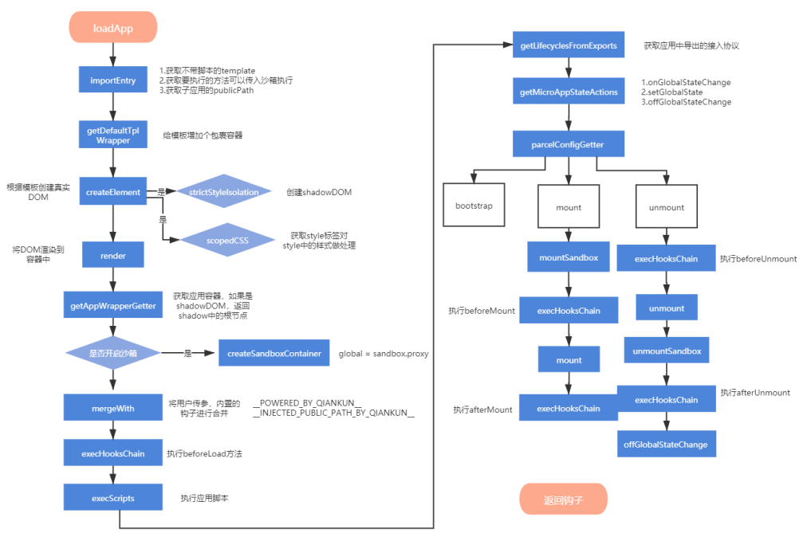

    参照这个流程在转码过的js文件里找到了template赋值的位置，这里拿到了子应用html的字符串

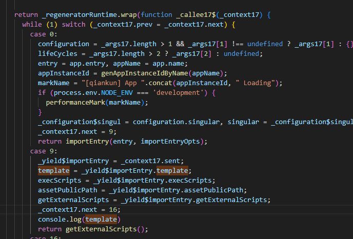
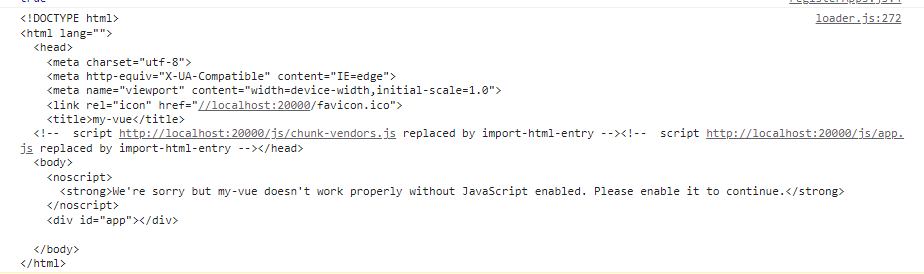

    调用getDefaultTplWrapper函数之后，template字符串变成了这样，安了个包裹容器

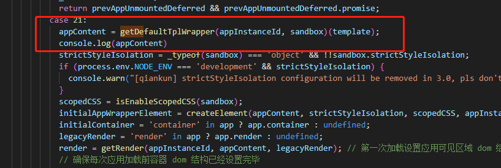
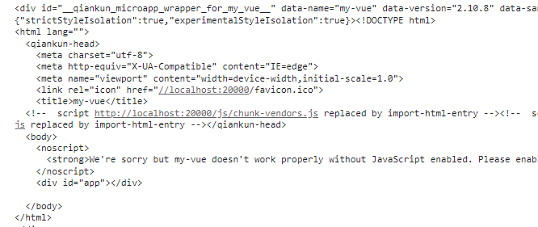

    调用createElement，这里使用了影子dom，接下来就一步步调下去了

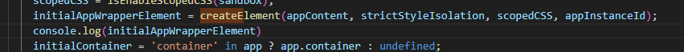
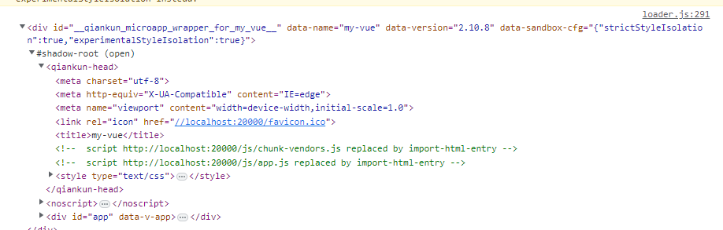

## css沙箱

    影子dom形式。mode: open/close可以控制影子dom能否被访问
    

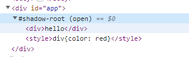

## JS沙箱
    
    快照沙箱
    1.空应用->vue应用
    在加载子应用的时候，记录window哪些属性被更改，相当于拍照
    2.vue应用到react应用
    将当前window的属性进行一次快照，然后再根据步骤1的快照还原widnow，再去加载react子应用
    3.react应用->vue应用
    将当前window属性进行一次快照，将window还原到2步骤中卸载vue之前的快照，之后加载vue应用

    缺点：window属性污染，只能支持单例子应用

    proxy沙箱
    与快照沙箱相比，用proxy对象代替window对象，并不会对window属性进行污染，能支持同时加载多个子应用
    缺点：proxy兼容性问题，在低版本浏览器下无法支持多例模式，单例会采用快照沙箱方案代替
    