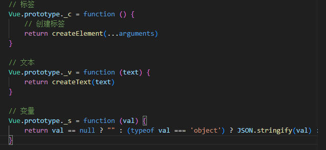
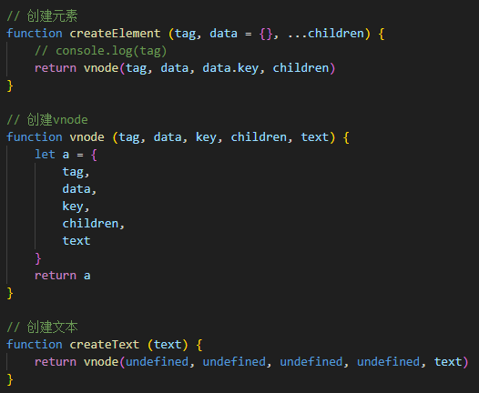
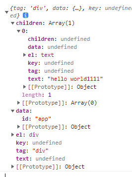
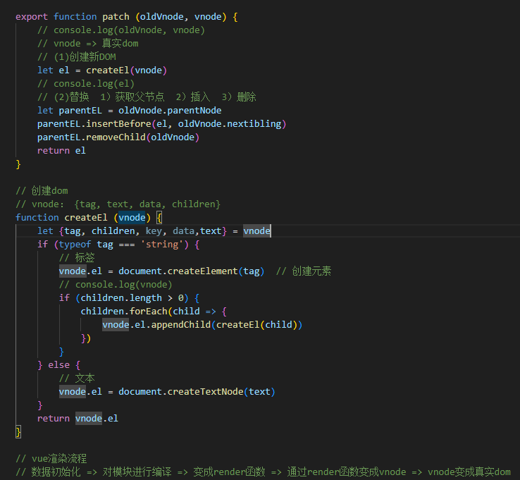

# render

## 切割解析

    vue2中vue-compile会对虚拟dom进行解析，比如：

    

        hello world{{msg}}
    

    使用正则进行匹配切割（paserAST.js）

    最终组装成一个object对象

## 生成render函数字符串

    (generate.js将html)切割后生成对应的函数字符串

    _c('div', {id:"app"}, _v("hello world"+_s(msg)))

    _c，_v，_s分别对应vm实例上创建的三个方法（vnode/index.js）

    _c处理标签，_v处理文本，_s处理变量

    将render函数字符串挂载到vm实例上，生成vNode（vnode/index.js）

    
    通过patch（vnode/patch.js）解析为真实dom

