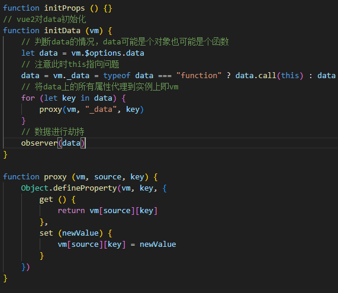
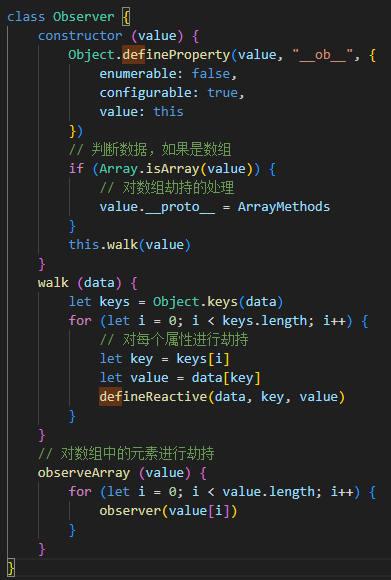
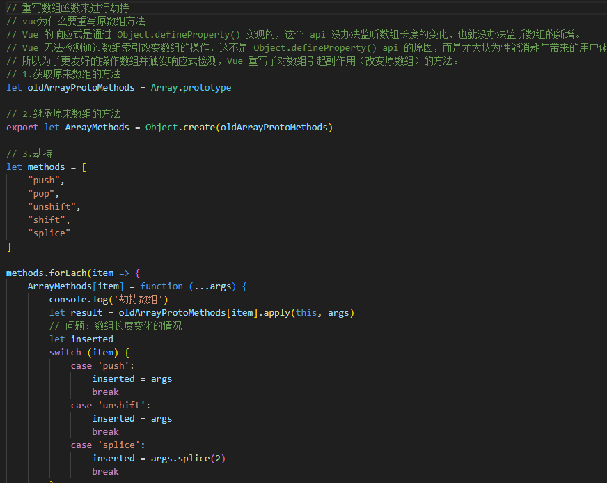

# 双向绑定

    从初始化入手(initstate.js)

    将options上面的数据统一挂载到vm实例上，然后再通过observer类来处理数据劫持

    在observer/index.js中对数据劫持进行处理

    注意此时，如果劫持的数据是数组的话，由于defineproperty的原因，对于改版数组下标的事件无法做到准确监听，vue为了实现这种功能所以对一些数组方法进行了重写（oberver/arr.js）

